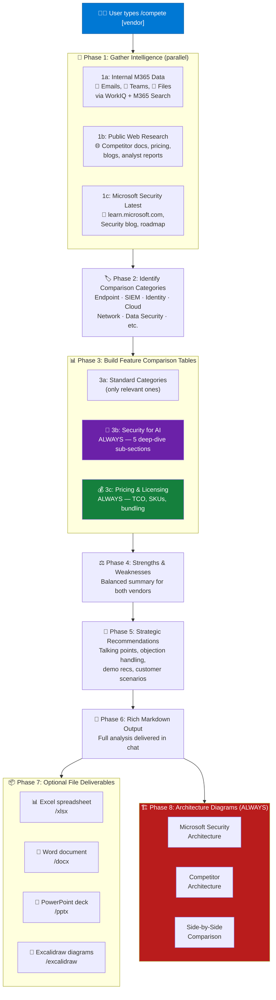

# 🛡️ /compete — Cybersecurity Competitive Analysis

> Type `/compete CrowdStrike` and get a full competitive analysis of Microsoft Security vs CrowdStrike in minutes, not hours.

---

## 📋 Table of Contents

- [What It Does](#-what-it-does)
- [The Problem It Solves](#-the-problem-it-solves)
- [How It Works](#-how-it-works)
- [Usage Examples](#-usage-examples)
- [What You Get](#-what-you-get)
- [Key Design Principles](#-key-design-principles)
- [Requirements](#-requirements)
- [Installation](#-installation)
- [Customization](#-customization)
- [FAQ](#-faq)

---

## ✨ What It Does

The `/compete` skill produces a thorough, technically deep competitive analysis comparing **Microsoft Security** capabilities against any named cybersecurity vendor. It combines internal Microsoft 365 intelligence, live public web research, and structured output into a single conversation — complete with feature comparison tables, pricing analysis, architecture diagrams, and optional file exports.

One command replaces hours of manual research across dozens of tabs.

---

## 🎯 The Problem It Solves

| Pain Point | How `/compete` Fixes It |
|---|---|
| ⏰ Security specialists spend **hours** manually researching competitors | Automates the entire workflow in **5–15 minutes** |
| 📂 Information is **scattered** across battle cards, emails, Teams, docs, and the web | Searches internal M365 data AND public web in parallel |
| 🔄 Battle cards go **stale** within weeks of creation | Every run does **live web research** — data is always current |
| 📊 No single tool combines internal intelligence + web research + structured output | Produces **referenced tables, pricing TCO, architecture diagrams**, and exports |
| 🤖 AI security is a **new battleground** with no established compete framework | Includes a **mandatory 5-section AI Security deep dive** in every analysis |
| 💰 Pricing comparisons are hand-wavy and lack concrete numbers | Generates **3-tier TCO scenarios** with itemized cost breakdowns |

---

## ⚙️ How It Works

### Workflow Overview



### Phase Breakdown

| Phase | What Happens | Tools Used |
|---|---|---|
| **1a** | Search your M365 mailbox, Teams chats, and OneDrive/SharePoint for prior battle cards and competitor intel | `m365_search_emails`, `m365_search_files`, `m365_search_chats`, WorkIQ |
| **1b** | Scrape competitor's website, docs, pricing pages, press releases, and analyst reports | `web_fetch` |
| **1c** | Pull latest Microsoft Security product capabilities, roadmap, and announcements | `web_fetch` |
| **2** | Determine which cybersecurity domains to compare (Endpoint, SIEM, Identity, Cloud, etc.) | AI reasoning |
| **3a** | Build feature-by-feature comparison tables for each relevant category | AI + sources |
| **3b** | 🤖 **Security for AI** — 5 mandatory sub-sections (AI-SPM, Runtime, AppSec, AI SOC, Multi-cloud) | `web_fetch` |
| **3c** | 💰 **Pricing & Licensing** — SKU breakdown, E5 bundling, 3-tier TCO scenarios, hidden costs | `web_fetch` |
| **4** | Balanced strengths & weaknesses for both vendors | AI synthesis |
| **5** | Actionable talking points, objection handling, demo recs | AI synthesis |
| **6** | Full markdown analysis delivered in chat | Native |
| **7** | Optional Excel, Word, PowerPoint, Excalidraw exports | `xlsx`, `docx`, `pptx`, `excalidraw` skills |
| **8** | Three architecture diagrams (Microsoft, Competitor, Side-by-side) — **always generated** | `excalidraw` skill |

---

## 💬 Usage Examples

```
/compete CrowdStrike
```

```
/compete Palo Alto
```

```
/compete Wiz
```

```
/compete SentinelOne
```

```
/compete Zscaler
```

```
compare Microsoft vs Zscaler in security
```

```
battle card for CrowdStrike
```

You can also trigger it conversationally:

```
I need competitive intelligence on Palo Alto's XSIAM vs Microsoft Sentinel
```

---

## 📦 What You Get

### In-Chat Output

Every `/compete` run delivers the following directly in your chat:

#### 📊 Feature Comparison Tables
Detailed feature-by-feature comparison tables for each relevant cybersecurity domain. Every claim includes a **source URL** for verification.

```
| Feature / Capability | Microsoft Security | [Competitor] | Advantage | Source (MS) | Source (Competitor) |
|---|---|---|---|---|---|
| Unified XDR portal | Defender XDR ✅ | Falcon Console ✅ | Tie 🟰 | [URL] | [URL] |
```

#### 🤖 Security for AI Deep Dive
Five mandatory sub-sections covering the full AI security landscape:

| Sub-Section | What's Covered |
|---|---|
| **AI-SPM** | AI workload discovery, AI-BOM, misconfiguration detection, shadow AI, compliance (OWASP LLM Top 10, NIST AI RMF, EU AI Act) |
| **AI Threat Protection** | Prompt injection detection, jailbreak blocking, data exfiltration, poisoning detection, rogue agent monitoring, MITRE ATT&CK mapping |
| **AI Application Security** | LLM firewall, AI gateway, responsible AI guardrails, model access control, supply chain security |
| **AI-Powered Security Operations** | Copilot for Security, NL query, AI-generated summaries, automated threat hunting, AI vulnerability prioritization |
| **Multi-Cloud AI Coverage** | Azure OpenAI, AWS Bedrock/SageMaker, Google Vertex AI, open-source models, SaaS AI apps |

#### 💰 Pricing & Licensing Analysis
Concrete numbers, not hand-waving:

- **Licensing model comparison** — per-seat vs per-resource vs consumption
- **SKU & plan breakdown** — every relevant Defender plan with per-unit pricing
- **E5/E3 bundling analysis** — what security capabilities are already included in existing licenses
- **3-tier TCO scenarios** — Small (500 VMs) / Medium (2K VMs) / Large (10K VMs) with itemized annual costs
- **Hidden costs** — data ingestion, agent overhead, training, integration, switching costs

#### ⚖️ Strengths & Weaknesses
Balanced, honest assessment for both vendors with references.

#### 🎯 Strategic Recommendations
- Key talking points for customer conversations
- Objection handling with counter-arguments
- Customer scenarios (where Microsoft wins vs where the competitor wins)
- Proof points — case studies, benchmarks, third-party validations
- Demo recommendations — which features to showcase
- Discovery questions to steer conversations toward Microsoft strengths

### 🏗️ Architecture Diagrams (Always Generated)

Three Excalidraw diagrams are produced with **every** analysis:

| Diagram | Description | File |
|---|---|---|
| **Microsoft Architecture** | Full Microsoft Security platform — Defender XDR, Sentinel, Entra, Purview, Copilot, AI security. Microsoft blue (#0078D4) color scheme. | `[vendor]-compete-ms-architecture.excalidraw` |
| **Competitor Architecture** | Complete competitor platform with all product modules, deployment model, and gaps highlighted in dashed red. Competitor brand colors. | `[vendor]-compete-[vendor]-architecture.excalidraw` |
| **Side-by-Side Comparison** | Two-column layout with aligned capabilities, color-coded advantages (green/red), and pricing summary. | `[vendor]-compete-comparison-architecture.excalidraw` |

### 📦 Optional File Exports

After the in-chat analysis, you'll be asked which additional deliverables you want:

| Deliverable | Skill Used | What's Included |
|---|---|---|
| 📊 **Excel spreadsheet** | `/xlsx` | Full comparison matrix with tabs per category, color-coded advantages, hyperlinked sources, dedicated AI Security and Pricing/TCO tabs |
| 📄 **Word document** | `/docx` | Professional compete report with executive summary, all tables, AI analysis, pricing, and strategic recommendations |
| 📑 **PowerPoint deck** | `/pptx` | Customer-facing or internal presentation with comparison slides, architecture diagrams, and key differentiators |
| 🎨 **Excalidraw diagrams** | `/excalidraw` | Individual architecture diagrams (also generated automatically in Phase 8) |
| 🗂️ **All of the above** | All skills | The complete package |

---

## 🧭 Key Design Principles

| # | Principle | Why It Matters |
|---|---|---|
| 1 | **Reference everything** | Every claim has a verifiable source URL. No unsubstantiated assertions. |
| 2 | **Be honest** | Acknowledge where competitors genuinely lead. Credibility comes from objectivity. |
| 3 | **Be current** | Live web research every run. The security landscape changes weekly. |
| 4 | **Think full stack** | Microsoft's advantage is platform integration (XDR + SIEM + Identity + Endpoint). Highlight it. |
| 5 | **Pricing wins deals** | Concrete TCO numbers and E5 bundling analysis — not vague "contact sales" guidance. |
| 6 | **AI security is mandatory** | The 5-section AI Security deep dive runs every time. It's the new battleground. |
| 7 | **Architecture is visual** | Three diagrams every run. Visuals communicate what tables can't. |
| 8 | **Think like a seller** | Frame analysis to help position Microsoft effectively while remaining objective. |

---

## 📋 Requirements

| Requirement | Details |
|---|---|
| **Clawpilot** | v1.0.0 or later |
| **M365 Authentication** | Signed in to Microsoft 365 (for internal intelligence in Phase 1a) |
| **Internet Access** | Required for web research (Phase 1b, 1c, pricing) |
| **Required Tools** | `web_fetch`, `m365_search_emails`, `m365_search_files`, `m365_search_chats`, `excalidraw` |
| **Optional Tools** | `WorkIQ` (enhanced M365 search), `pptx` skill, `docx` skill, `xlsx` skill |

> **Note:** The skill works without M365 authentication, but Phase 1a (internal intelligence) will be skipped. You'll still get full public web research, feature tables, pricing analysis, and architecture diagrams.

---

## 🔧 Installation

### Option 1: Copy the skill folder

**Windows (PowerShell)**
```powershell
xcopy /E /I "compete" "%USERPROFILE%\.copilot\m-skills\compete"
```

**macOS / Linux (Terminal)**
```bash
mkdir -p ~/.copilot/m-skills
cp -r compete ~/.copilot/m-skills/compete
```

### Option 2: Clone the full repo

**Windows (PowerShell)**
```powershell
git clone https://github.com/Itaiaharonov/clawpilot-skills.git
cd clawpilot-skills
xcopy /E /I "compete" "%USERPROFILE%\.copilot\m-skills\compete"
```

**macOS / Linux (Terminal)**
```bash
git clone https://github.com/Itaiaharonov/clawpilot-skills.git
cd clawpilot-skills
mkdir -p ~/.copilot/m-skills
cp -r compete ~/.copilot/m-skills/compete
```

### Option 3: One-liner install (macOS / Linux)

```bash
git clone https://github.com/Itaiaharonov/clawpilot-skills.git /tmp/clawpilot-skills \
  && mkdir -p ~/.copilot/m-skills \
  && cp -r /tmp/clawpilot-skills/compete ~/.copilot/m-skills/ \
  && rm -rf /tmp/clawpilot-skills \
  && echo "✅ /compete skill installed!"
```

### Option 4: Manual install via Clawpilot UI

1. Open Clawpilot
2. Go to **Settings → Skills → Create New Skill**
3. **Name:** `compete`
4. **Description:** Copy from [`skill.json`](./skill.json)
5. **Instructions:** Copy the full contents of [`instructions.md`](./instructions.md)

### Verify

```
/compete
```

Or ask: `Can you list my skills?`

---

## 🛠️ Customization

The skill's behavior is fully defined in [`instructions.md`](./instructions.md). You can customize it by editing that file:

| What to Customize | Where to Edit |
|---|---|
| **Comparison categories** | Phase 2 — add/remove cybersecurity domains |
| **AI Security sub-sections** | Phase 3b — adjust the 5 AI security focus areas |
| **Pricing scenarios** | Phase 3c-4 — modify the Small/Medium/Large TCO parameters |
| **Strategic recommendations** | Phase 5 — tailor talking points for your specific market or region |
| **Output format** | Phase 6 — adjust the markdown structure or table format |
| **Mandatory deliverables** | Phase 8 — change which diagrams are always generated |

### Examples

**Add an industry-specific TCO scenario:**
Edit Phase 3c-4 in `instructions.md` and add a fourth scenario (e.g., Healthcare with HIPAA compliance costs).

**Focus on a specific product area:**
Modify Phase 2 to always include certain categories (e.g., always include IoT/OT Security for manufacturing customers).

**Change diagram style:**
Edit Phase 8 to adjust color schemes, layout, or which components appear in architecture diagrams.

---

## ❓ FAQ

**Q: How long does a full analysis take?**
> A: **5–15 minutes** depending on the vendor's breadth of products and how much internal M365 data is found. Vendors with extensive public documentation (CrowdStrike, Palo Alto) tend to produce richer results.

**Q: Can I use it without M365 authentication?**
> A: **Yes.** You'll miss Phase 1a (internal intelligence — emails, Teams, files), but you'll still get the full public web research, feature tables, pricing analysis, architecture diagrams, and strategic recommendations.

**Q: Does it work for non-security vendors?**
> A: It's **optimized for cybersecurity** vendors (the comparison categories, AI security deep dive, and pricing framework are all security-specific). The framework could be adapted for other domains by editing `instructions.md`, but out of the box it's built for security compete scenarios.

**Q: How current is the data?**
> A: Every run does **live web research** — data is as current as the public web. There is no cached or pre-built database. This means results improve over time as vendors update their public documentation.

**Q: Can I run it for the same vendor multiple times?**
> A: **Absolutely.** Each run does fresh research. This is useful for tracking how a competitor's capabilities evolve over time, or for generating different output formats.

**Q: What if a competitor's pricing isn't public?**
> A: The skill notes when pricing is "contact sales only" and provides **estimated ranges** from public sources (analyst reports, G2 reviews, Gartner peer insights, customer testimonials). All estimates are clearly flagged with ⚠️.

**Q: Can I customize which sections are generated?**
> A: **Partially.** The standard categories (Phase 3a) are dynamically selected based on vendor relevance. The AI Security deep dive (Phase 3b), Pricing analysis (Phase 3c), and Architecture diagrams (Phase 8) are **always generated** — they're considered core to every compete analysis. You can modify this behavior by editing `instructions.md`.

**Q: Where are the output files saved?**
> A: File exports (Excel, Word, PowerPoint, Excalidraw) are saved to the **current working directory** or, if a customer context is mentioned, to the relevant customer engagement repo under a `compete/` subfolder.

---

## 📁 Files in This Skill

```
compete/
├── skill.json          # Metadata — name, version, triggers, required tools
├── instructions.md     # Full AI instructions (9-phase workflow)
└── README.md           # This file — human documentation
```

---

## 📄 License

[MIT License](../LICENSE) — Copyright © 2026 Itai Aharonov

---

<p align="center">
  Part of <a href="../"><strong>Clawpilot Skills</strong></a> · Built for Microsoft Security specialists
</p>
